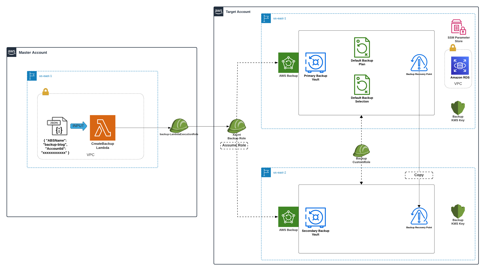

# AWS Backup Data Protection Plan

A solution for centralized backup management of RDS databases across multiple AWS accounts with enhanced security and cross-region replication capabilities. This project provides a streamlined approach to managing backup operations for data stored in Amazon RDS databases using AWS Backup and AWS Lambda. It enables centralized backup management across multiple AWS accounts, ensuring compliance, security, and automation.

## Solution Overview

This solution provides an automated approach to manage backup operations for RDS databases using AWS Backup service. It implements a multi-account strategy where a master account controls backup resources across target accounts, ensuring standardized backup policies while allowing for custom configurations.

### Key Features

- Centralized backup management across multiple AWS accounts
- Automated cross-region backup replication (us-east-1 to us-east-2)
- KMS encryption for enhanced security
- Tag-based resource selection
- Automated backup reporting and monitoring
- Compliance tracking through AWS Backup Audit Manager

## Prerequisites

- Two AWS Accounts:
  - Master Account: Permissions for AWS CloudFormation, Lambda, VPC, EC2, CloudWatch, IAM, and S3
  - Target Account: Permissions for AWS Backup, KMS, RDS, VPC, IAM, and EC2
- AWS CLI configured
- Basic knowledge of AWS services

## Installation

1. Clone the repository:
```bash
git clone https://github.com/aws-samples/automated-data-protection-plan-with-aws-backup.git
cd automated-data-protection-plan-with-aws-backup
```

## Components

- AWS Backup
- AWS Lambda
- AWS KMS (Multi-Region Keys)
- Amazon RDS
- AWS IAM
- AWS Systems Manager Parameter Store

## ARCHITECTURE DIAGRAM



## IAM Roles

AWSBackup-Custom:-
Facilitates AWS Backup service operations, allowing RDS backup, encryption, and cross-region copy operations.

XacntBackupRole:-
Used by the master account’s Lambda function to perform backup operations across multiple AWS accounts.

## Deployment Steps

1.	Clone the Source Code Repository:
•	Clone the source code repository from the AWS Samples GitHub to your local machine.

2.	Upload Lambda Function Zip Files:
•	Zip the python files with 'aws_backup_create.py.zip' and 'aws_backup_delete.py.zip' as the object key names.Upload the two Lambda function zip files from the 'Lambda_Code' folder of the cloned repository to your master account's Amazon S3 bucket, using 'aws_backup_create.py.zip' and 'aws_backup_delete.py.zip' as the object key names. 
Note: These Lambda functions are used to create and delete AWS Backup resources in the target account.

3.	Deploy the Master Account CloudFormation Template:
•	Deploy the 'masterAcct.yml' CloudFormation template from the 'CloudFormation_Templates' folder of the cloned repository in the AWS CloudFormation console of the master account. 
•	This template is for setting up AWS Lambda functions to create and delete backups, along with the necessary roles and permissions.

4.	Deploy the Target Account CloudFormation Template:
•	Deploy the 'targetAcct.yml' CloudFormation template from the 'CloudFormation_Templates' folder of the cloned repository in the AWS CloudFormation console of the target account's primary region (i.e us-east-1). 

•	This template creates below resources:
o	SSM Parameter Store parameter for an AWS Backup Plan, storing the backup plan configuration as a JSON object that can be referenced by AWS Backup to perform backups. 
o	Amazon RDS instance with the specified DB engine in a VPC.
o	IAM role required for the master account's Lambda functions to perform AWS Backup service deployment operations on the target account.
o	A custom role with specific AWS Backup policies used for performing backup operations in the target account.

5.	Create a KMS Multi-Region Key in the secondary region (us-east-2) region:
Deploy the KMSMultiRegionReplica.yml CloudFormation template in the target account’s us-east-2 region. Make sure you provide the KMSKeyArn id of the KMS alias ‘BackupBlogCredential’ Review the ‘user guide’ for more details on the deployment process.

## Monitoring & Reporting
AWS Backup provides job status tracking and audit reports for compliance. Backup events can be monitored via AWS CloudWatch and SNS notifications.

## Cleanup Process
- Run the 'DeleteBackupLambda' function in the master account to remove backup resources.
- Verify that all recovery points are deleted (this may require multiple executions of the function).
- Delete CloudFormation stacks from both the master and target accounts to remove all associated resources.

## Conclusion
This solution simplifies AWS Backup management across multiple accounts, ensuring data protection, compliance, and automation. It can be extended to other AWS services beyond RDS by modifying backup selection criteria.
